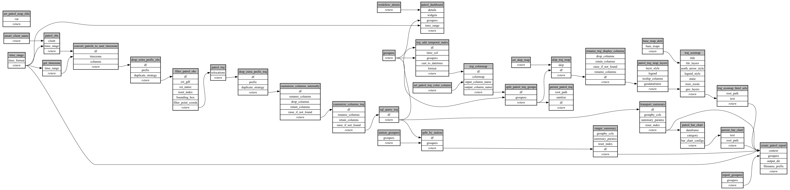

```
# AUTOGENERATED BY ECOSCOPE-WORKFLOWS; see fingerprint in README.md for details

```

```yaml
# fingerprint:
artifacts_sha256_basic: 77fcd72c4bc7b7caaee3199a46288d47d3ae3893d6e9421c9715b4fe34aff4f6
artifacts_sha256_strict: 03c96d51ee4ce0a6d7bb0475dad48b58d66242e581d59a598636ec747ba8a37f
installed_requirements:
- channel: https://repo.prefix.dev/ecoscope-workflows/
  name: ecoscope-workflows-core
  version: {version: ==0.22.17}
- channel: https://repo.prefix.dev/ecoscope-workflows/
  name: ecoscope-workflows-ext-ecoscope
  version: {version: ==0.22.17}
- channel: https://repo.prefix.dev/ecoscope-workflows-custom/
  name: ecoscope-workflows-ext-custom
  version: {version: ==0.0.40}
- channel: https://repo.prefix.dev/ecoscope-workflows-custom/
  name: pydeck
  version: {version: ==0.9.1a2}
params_sha256: 3ad34a3dcaabb385739fdbd16218d40bddf074c5b1faaa48b51c35f8508b791e
spec_sha256: f6d1da5f2097e5a25fc3ddc20533cc68792d9f188d0e43cce32091d673eb711b

```

# ecoscope-workflows-mt-patrols-workflow


