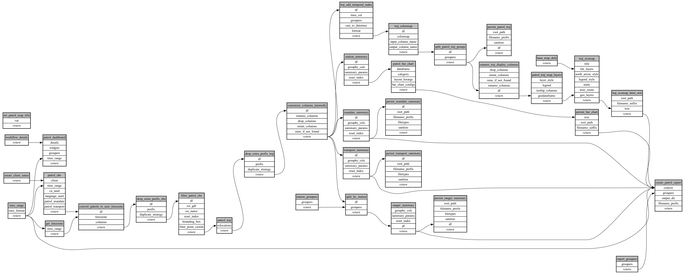

```
# AUTOGENERATED BY ECOSCOPE-WORKFLOWS; see fingerprint in README.md for details

```

```yaml
# fingerprint:
artifacts_sha256_basic: 248d192a87e001dc93015e49f55bb3b711688cf170a4912fb0fec08ff2bdd4c5
artifacts_sha256_strict: d55d1e8029347939a58d603ef86afa6a5638efc3861085851d7f74227a7e2126
installed_requirements:
- channel: https://repo.prefix.dev/ecoscope-workflows/
  name: ecoscope-platform
  version: {version: ==2.18.2}
- channel: https://repo.prefix.dev/ecoscope-workflows-custom/
  name: ecoscope-workflows-ext-custom
  version: {version: ==0.1.0rc24}
- channel: conda-forge
  name: pydeck
  version: {version: ==0.9.2}
params_sha256: e7a448e834dba09f5961ad2a82274091ec7de17c3cdda24cb46780955f261984
spec_sha256: 471d5050195d1462e1d6b909d69d9d3a7a3ff02979f7ba6e95ee670bf4a9273b

```

# ecoscope-workflows-mt-patrols-workflow


